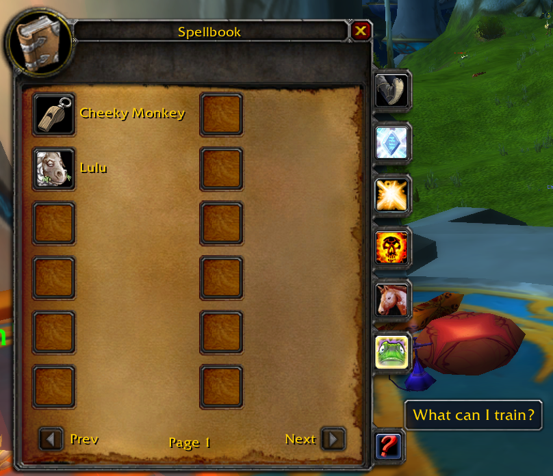
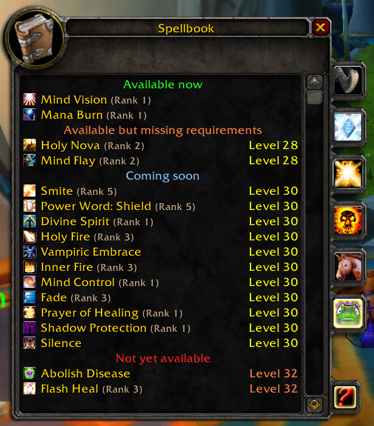
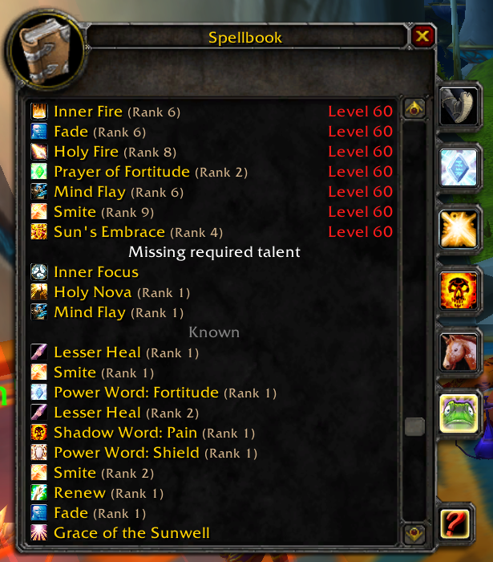

# What's Training? Turtle WoW port

What's Training? is an addon for Turtle WoW that adds a list of available trainer spells to the spell book, so you can easily know when to seek a class trainer out. Spells you already know will show up separately, at the end of the list.

Please feel free to create any issues.